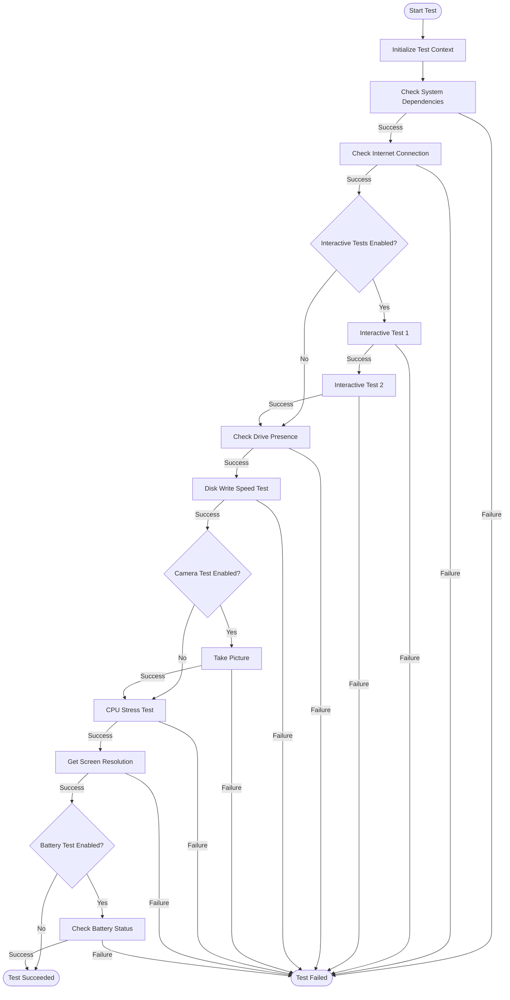
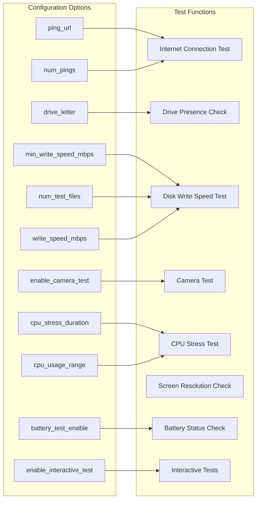
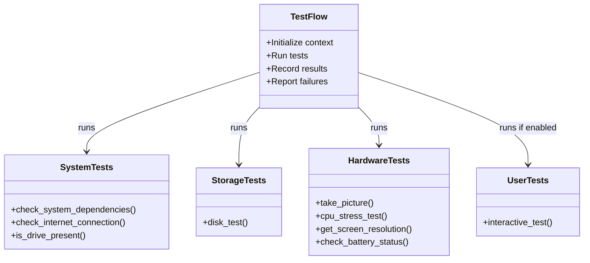
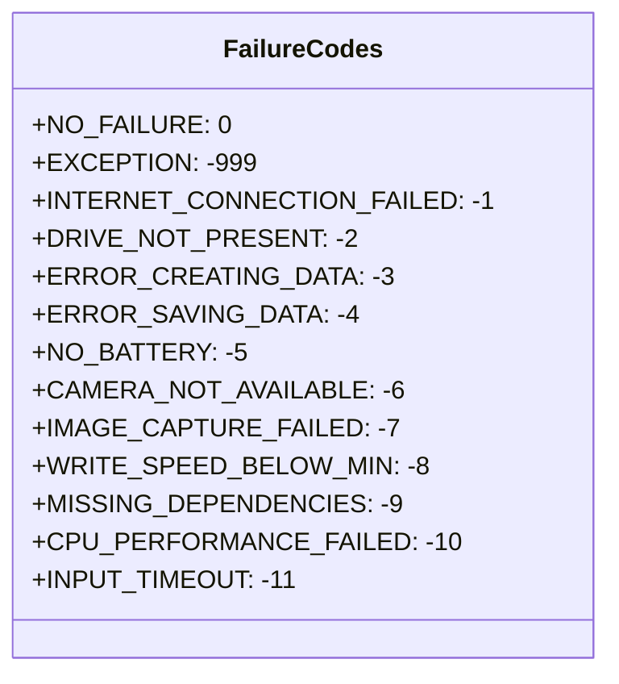

# Onnyx Example Test Flow

This document explains the example test flow in a way that's easy to understand for non-programmers and developers alike.

## What This Test Does

This test is designed to verify that a device (like a laptop or computer) is functioning correctly by running a series of checks. Think of it like a health check-up for your computer that tests various components:

- System dependencies (required software)
- Internet connection reliability
- Storage drive presence and accessibility
- Disk write speed performance
- Camera functionality (optional)
- CPU performance under stress
- Screen resolution verification
- Battery status and health (if applicable)
- Interactive user tests (optional)

## Test Flow Diagram



## Configuration Options Explained

The test uses a configuration object called `_cell_config_obj` that controls how the tests run. Here's what each setting does:

| Setting                   | Description                                  | Default Value                  |
| ------------------------- | -------------------------------------------- | ------------------------------ |
| `battery_test_enable`     | Whether to check the battery status          | `True`                         |
| `cpu_stress_duration`     | How long to stress test the CPU (in seconds) | `5`                            |
| `cpu_usage_range`         | Acceptable range for CPU usage (%)           | `{"min": 1, "max": 100}`       |
| `drive_letter`            | Which drive to check                         | `"C"` on Windows, `/` on Linux |
| `enable_camera_test`      | Whether to test the camera                   | `True`                         |
| `enable_interactive_test` | Whether to run tests that need user input    | `True`                         |
| `min_write_speed_mbps`    | Minimum acceptable disk write speed (MB/s)   | `100`                          |
| `num_test_files`          | Number of files to create during disk test   | `10`                           |
| `ping_url`                | Website to ping for internet test            | `"https://www.google.com"`     |
| `num_pings`               | Number of pings to perform                   | `5`                            |
| `write_speed_mbps`        | Acceptable range for disk write speed        | `{"min": 500, "max": 10000}`   |

## Configuration to Test Relationship



## Test Components Diagram



## How Each Test Works

### System Dependencies Check

Verifies that all required software is installed on the computer. This ensures that the test environment has all necessary tools to run the subsequent tests.

### Internet Connection Test

Pings a website (default: Google) to check if the internet is working. The test measures response times and verifies connectivity by sending multiple ping requests.

### Interactive Tests

If enabled, asks the user questions that require manual responses. These tests can verify user interface elements or gather information that can only be provided by a human operator.

### Drive Presence Check

Verifies that the specified drive (C: on Windows, / on Linux) exists and is accessible. This is a fundamental check to ensure storage is available.

### Disk Write Speed Test

Creates test files and measures how fast data can be written to disk. This test helps identify storage performance issues by writing multiple files and calculating the throughput.

### Camera Test

If enabled, takes a picture using the computer's camera and analyzes the image. This verifies that the camera hardware is functioning correctly and can capture images.

### CPU Stress Test

Runs intensive calculations to test CPU performance under load. This test helps identify potential thermal throttling or performance issues by pushing the CPU to high utilization.

### Screen Resolution Check

Gets the current screen resolution and verifies it meets minimum requirements. This ensures the display is functioning at the expected resolution.

### Battery Status Check

If enabled, checks the battery level and charging status. This test verifies that the battery is present, can hold a charge, and reports its status correctly.

## Test Results

Each test returns one of these results:

- **Success**: The test passed all checks
- **Failure**: The test failed with a specific error code (see Failure Codes section)
- **Exception**: An unexpected error occurred during test execution

## How to Run the Test

The test is run by executing the `example_flow.py` script, which uses the configuration settings to determine which tests to run and what parameters to use.

```python
# Example of running the test
from example_flow import example_flow

# Create test document with configuration
test_document = {
    "_cell_config_obj": {
        "battery_test_enable": True,
        "cpu_stress_duration": 5,
        "enable_camera_test": True,
        # Add other configuration options as needed
    },
    "_cell_settings_obj": {
        # Settings for the test environment
    }
}

# Run the test flow
example_flow(test_document, settings={})
```

## Failure Codes

When a test fails, it returns a specific failure code that helps identify what went wrong:



## Troubleshooting Common Issues

If tests fail, here are some common solutions:

| Failure Code               | Possible Solutions                                                 |
| -------------------------- | ------------------------------------------------------------------ |
| INTERNET_CONNECTION_FAILED | Check network cables, Wi-Fi connection, or try a different network |
| DRIVE_NOT_PRESENT          | Verify drive is properly connected and mounted                     |
| WRITE_SPEED_BELOW_MIN      | Check for disk fragmentation or hardware issues                    |
| MISSING_DEPENDENCIES       | Install required software packages                                 |
| CAMERA_NOT_AVAILABLE       | Check camera drivers or hardware connections                       |
| CPU_PERFORMANCE_FAILED     | Check for thermal throttling or background processes               |
| NO_BATTERY                 | Connect battery or run on a device with battery                    |

## Extending the Test Flow

To add new tests to the flow:

1. Create a new test function in `example_tests.py` using the `@test()` decorator
2. Add appropriate failure codes to the `FailureCodes` class
3. Update the `example_flow.py` to include your new test in the flow
4. Add any new configuration options to the `_cell_config_obj`
